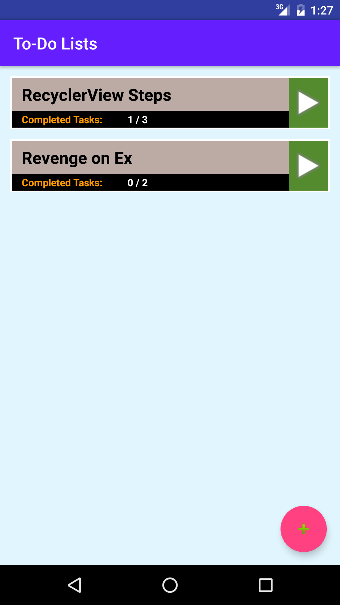
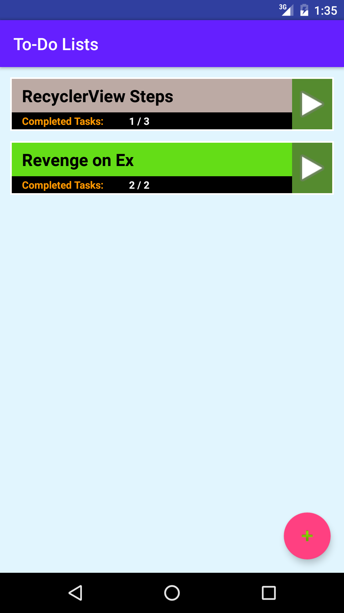
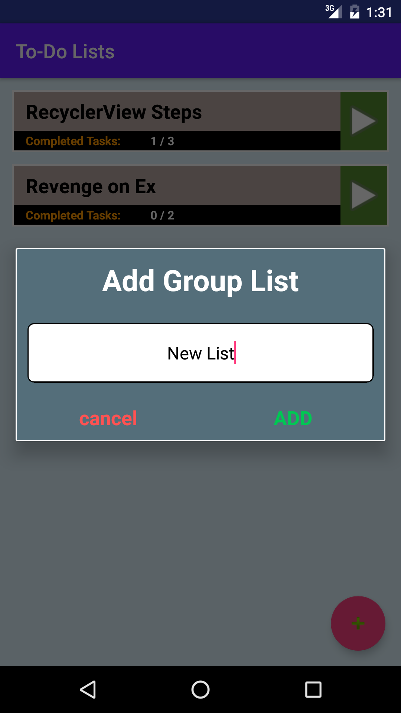
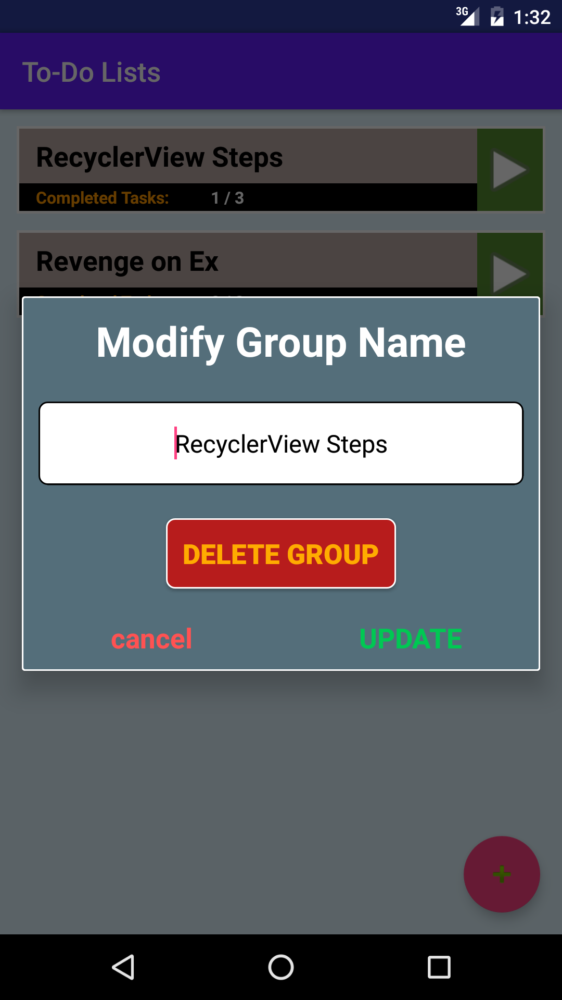
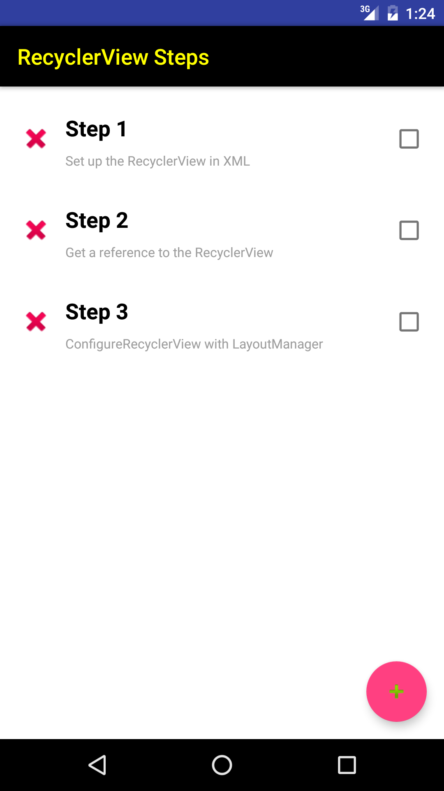
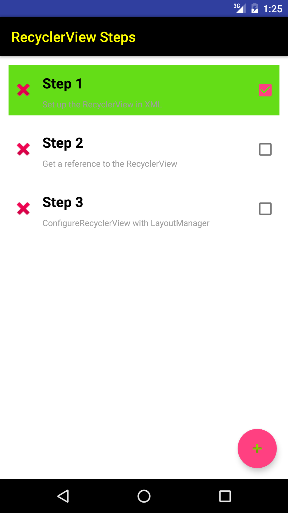
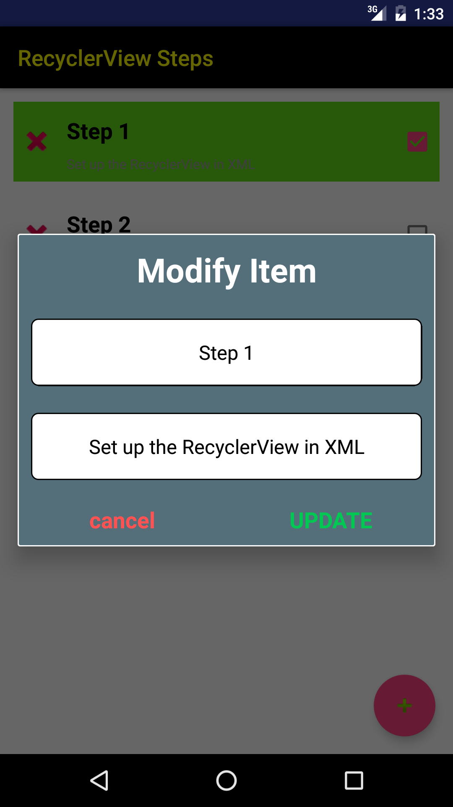
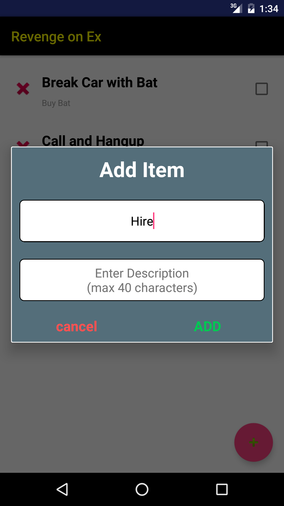

## Instructions for Use:

- On the home screen, tap the "Plus" floating action button to bring up a popup to create a new ToDo list. Enter a List name and tap "ADD" to add to screen.
- Once a list has been added you can tap the name to bring up a popup to modify the name and/or delete the entire list.
- Tap the "Play" button on the right of a list to access the Item list.

- On the Item list screen, tap the "Plus" floating action button to bring up a popup to create a new Item. Enter a name and description and tap "ADD" to add to the screen.
- With the Item added, you can tap the "X" on the left to delete the item or tap the "CheckBox" on the right to indicate the task has been complete. The parent ToDo will update accordingly.
- You can also tap the name to bring up a popup to modify the name or description.
- Press the back button to go back to the first screen.

**Known Issues**

- You may find a few extra lines of code here and there and extra variables in classes. This is because I was setting the app ready to add a SQLite database which will utilize that data but did not have time to implement. I did not want to delete any of the code in case it might break existing code and also because I might add the database in the future.

